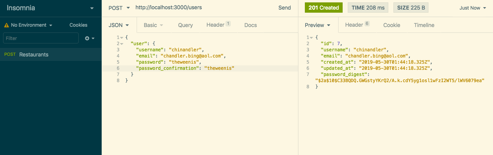

# Rails Authentication

### Objectives
*After this lesson, students will be able to:*

- Understand how to set and retrieve data from `session`
- Know how to set and check passwords using `BCrypt`
- Understand how to keep track of a `current_user`
  - `sign_in`/`sign_out`, `ensure_signed_in`/`ensure_signed_out`
- Be able to create a Rails app with Auth without using [`Devise`](https://github.com/plataformatec/devise)
  - Not from memory, but from following along with an example

  
### Preparation
*Before this lesson, students should:*

- Be able to make a Rails app without auth

---

This tutorial is for adding authentication to a vanilla Ruby on Rails application using [`bcrypt`](https://github.com/codahale/bcrypt-ruby) and `has_secure_password`.

The point of authentication is to ensure that the user is who they say they are. The standard way of managing this is through registering your user using a sign-up form. Once the registered user is logged in, you keep track of them using a session until they log out.

User Authentication allows us to restrict access to a portion of the application so that only users who log in with a valid username and password can have access.

### Create a new Rails API

To create a new Rails app, we use the `rails new` command. This sets us up with our skeleton Rails app. In the Terminal, in the directory where you want to create a project, generate a new Rails project and cd into it:

```
$ rails new my-rails-auth-project --api --database=postgresql -JSTCMG --skip-turbolinks --skip-coffee --skip-active-storage --skip-bootsnap
$ cd my-rails-auth-project
```

### Setup the database
Set up an empty database:

```
$ rails db:create
```
it will return the following:

```
Created database 'my-rails-auth-project_development'
Created database 'my-rails-auth-project_test'
```

Open the project in the current directory using your text editor:

```
$ subl .
```
Start the server and open up the project in the browser, `localhost:3000`:

```
$ rails server
```

## USERS

### Generate User model 
Create a User model with `username` and `email` attributes as well as the optional string parameters.

```
$ rails g model User username:string email:string

# run the migration to update the database with this change
$ rails db:migrate
```

Before running the migration, check the `db/migrate/[timestamp]_create_users.rb` folder to make sure the migration is accurate:

```
class CreateUsers < ActiveRecord::Migration[5.2]
  def change
    create_table :users do |t|
      t.string :username
      t.string :email

      t.timestamps
    end
  end
end
```

Your Terminal window will return the following information:

```
== [timestamp] CreateUsers: migrating ======================================
-- create_table(:users)
   -> 1.8143s
== [timestamp] CreateUsers: migrated (1.8169s) =============================
```

while your schema should look like the following:

```
  create_table "users", force: :cascade do |t|
    t.string "username"
    t.string "email"
    t.datetime "created_at", null: false
    t.datetime "updated_at", null: false
  end
```

Navigate to the `app/models/User.rb` file:

```
class User < ApplicationRecord
end
```
Then, step into the Rails console to create a new User:

```
$ rails c --sandbox

# create a new user object
>> User.new
=> #<User id: nil, name: nil, email: nil, created_at: nil, updated_at: nil>

>> user = User.new(username: 'clayne', email: 'celeste.layne@hotmail.com')
=> #<User id: nil, username: "clayne", email: "celeste.layne@hotmail.com", created_at: nil, updated_at: nil>

>> user.valid?
=> true

>> user.save
   (14.2ms)  SAVEPOINT active_record_1
  User Create (49.3ms)  INSERT INTO "users" ("username", "email", "created_at", "updated_at") VALUES ($1, $2, $3, $4) RETURNING "id"  [["username", "clayne"], ["email", "celeste.layne@hotmail.com"], ["created_at", "2019-02-21 22:03:32.018011"], ["updated_at", "2019-02-21 22:03:32.018011"]]
   (9.8ms)  RELEASE SAVEPOINT active_record_1
=> true

>> user
=> #<User id: 1, username: "cayne", email: "celeste.layne@hotmail.com", created_at: "2019-02-21 22:03:32", updated_at: "2019-02-21 22:03:32">

>> user.username
=> "clayne"

>> user.email
=> "celeste.layne@hotmail.com"

>> user.created_at
=> Thu, 21 Feb 2019 22:03:32 UTC +00:00

>> User.find(1)
=> #<User id: nil, name: "Celeste Layne", email: "celeste.layne@hotmail.com", created_at: nil, updated_at: nil>

>> User.find(3)
=> ActiveRecord::RecordNotFound (Couldn't find User with 'id'=3)

>> user.email = "celeste.layne@gmail.com"
=> "celeste.layne@gmail.com"

>> user
=> #<User id: 1, name: "Celeste Layne", email: "celeste.layne@gmail.com", created_at: "2019-02-21 22:03:32", updated_at: "2019-02-21 22:03:32">

>> user.save
   (26.3ms)  SAVEPOINT active_record_1
  User Update (45.6ms)  UPDATE "users" SET "email" = $1, "updated_at" = $2 WHERE "users"."id" = $3  [["email", "celeste.layne@gmail.com"], ["updated_at", "2019-02-21 22:27:35.687162"], ["id", 1]]
   (12.0ms)  RELEASE SAVEPOINT active_record_1
=> true
```
_Note:_ The `id` has been assigned a value of 1; while `updated_at` / `created_at` have been assigned the current time and date.

Another way to update records is using `update_attributes`:

```
>> user.update_attributes(username: "dayne", email: "dennis@trinimail.com")
   (1.8ms)  SAVEPOINT active_record_1
  User Update (8.3ms)  UPDATE "users" SET "username" = $1, "email" = $2, "updated_at" = $3 WHERE "users"."id" = $4  [["username", "dlayne"], ["email", "dennis@trinimail.com"], ["updated_at", "2019-02-21 22:29:58.364706"], ["id", 1]]
   (0.4ms)  RELEASE SAVEPOINT active_record_1
=> true

>> user.username
=> "dlayne"
```

### Validations

At this point, any string we decide to type into the name and email fields is valid. Active Record allows us to impose constraints using validations. Some of the most common validations include: _presence, length, and uniqueness_.

###### Validating the presence of a name and email attribute
Presence verifies that a given attribute (in this case, name and email) is present using the validates method with argument presence: true.

```
class User < ApplicationRecord
    validates :name, presence: true
    validates :email, presence: true
end
```
###### Validating email format

The standard Ruby library has built in regular expression to validate emails. We do this using [URI](https://www.rubydoc.info/stdlib/uri/URI/MailTo) which stands for Uniform Resoure Identifers. URI is a baked in module in Rails.

```
class User < ApplicationRecord
    ...
    validates :email, presence: true
    validates :email, format: { with: URI::MailTo::EMAIL_REGEXP, message: "only allows valid emails" }
end
```

###### Validating length
Length verifies that a name field with a maximum of 50 characters will not validate names that are 51 characters in length.

```
class User < ApplicationRecord
    validates :name, presence: true, length: { maximum: 50 }
    validates :email, presence: true, length: { maximum: 255 }
end
```
###### Validating uniqueness
Uniqueness of email addresses uses the :unique option for the validates method.

```
class User < ApplicationRecord
    validates :name, presence: true, length: { maximum: 50 }
    validates :email, presence: true, length: { maximum: 255 }, uniqueness: true
end
```
_Note:_ Active Record uniqueness validation does not guarantee uniqueness at the database level, so it may happen that two different database connections create two records with the same value for a column that you intend to be unique.

The solution is to enforce uniqueness at the database level as well as at the model level. Our method is to create a database index on the email column, and then require that the index be unique.

###### Generate index on username [or email]

```
$ rails generate migration add_index_to_users_email
```
The migration will look like the following:

```
# db/migrate/[timestamp]_add_index_to_users_email.rb

class AddIndexToUsersEmail < ActiveRecord::Migration
  def change
  	# use add_index method to add an index on the email column of the users table
  	add_index :users, :email, unique: true
  end
end
```
_Note:_  the option `unique: true` enforces uniqueness

Don't forget to migrate:

```
$ rails db:migrate
```
The users table in the `db/schema.rb` file now includes the following line:

```
  create_table "users", force: :cascade do |t|
    ...
    t.index ["email"], name: "index_users_on_email", unique: true
  end
```

### Add Dependencies

In the Gemfile, uncomment bcrypt:

```
gem 'bcrypt', '~> 3.1.7'
```
We need bcrypt to securely store passwords in our database. Then, from the root of the application, run the following command:

```
$ bundle install
```

Then, restart your server.

### Passwords

Rails has a method called `has_secure_password` which you include in your User model and it  adds a lot of the functionality. The only requirement for `has_secure_password` is for the corresponding model to have an attribute called `password_digest`.

Let's generate a migration to add the `password_digest` column to the users table:

```
$ rails generate migration add_password_digest_to_users password_digest:string
```
Here, we’ve used a migration name that ends in `_to_users` to tell Rails that the migration is designed to alter the users table in the database. Because we also included the attribute (password_digest) and type (string), Rails generates a default migration for us that looks like the following:

```
# db/migrate/[timestamp]_add_password_digest_to_users.rb

class AddPasswordDigestToUsers < ActiveRecord::Migration[5.2]
  def change
    add_column :users, :password_digest, :string
  end
end
```
Migrate the database to apply this change:

```
$ rails db:migrate
```
It's at this point we add `has_secure_password` to the User model. `has_secure_password` uses bcrypt to hash (encrypt?) the password via authentication methods.

```
class User < ApplicationRecord
    validates :name, presence: true, length: { maximum: 50 }
    validates :email, presence: true, length: { maximum: 255 }, uniqueness: true
    
    has_secure_password
end
```
Now, include a presence validation and minimum length to ensure nonblank passwords, to the password attribute:

```
class User < ApplicationRecord
    validates :name, presence: true, length: { maximum: 50 }
    validates :email, presence: true, length: { maximum: 255 }, uniqueness: true
    
    has_secure_password
    validates :password, presence: true, length: { minimum: 6 }
end
```

Now in our rails console, we can set a password and check if it matches:

```
>> user.password = 'jeopardy'
=> "jeopardy"

>> user.save
   (32.3ms)  SAVEPOINT active_record_1
  User Exists (36.0ms)  SELECT  1 AS one FROM "users" WHERE "users"."email" = $1 LIMIT $2  [["email", "celeste.layne@hotmail.com"], ["LIMIT", 1]]
  User Create (56.7ms)  INSERT INTO "users" ("name", "email", "created_at", "updated_at", "password_digest") VALUES ($1, $2, $3, $4, $5) RETURNING "id"  [["name", "Celeste Layne"], ["email", "celeste.layne@hotmail.com"], ["created_at", "2019-02-21 23:04:10.621861"], ["updated_at", "2019-02-21 23:04:10.621861"], ["password_digest", "$2a$10$UZoyMjCRLI84VJe2XsAX3.wA7xa2xQMFyTfgcqzYO0a1OaNHso8XW"]]
   (0.6ms)  RELEASE SAVEPOINT active_record_1
```
_Note:_ Saving the record returns the encrypted password digest and NOT the password ('jeopardy')

Authenticate a user given the name and password:

```
class User < ApplicationRecord
    has_secure_password
    
    validates :name, presence: true, length: { maximum: 50 }
    validates :email, presence: true, length: { maximum: 255 }, uniqueness: true
    validates :email, format: { with: URI::MailTo::EMAIL_REGEXP }
    
    validates :password, 
    	presence: true, 
    	length: { minimum: 6 },
    	if: -> { new_record? || !password.nil? }
end
```
Active Record uses the `new_record?` instance method to determine whether an object is already in the database or not. As implied by the `?`, it returns true or false. This validation says that for every new entry, the password must be a minimum of 6 characters long.

Now, find the user record by the email address:

```
>> User.find_by(email: "celeste.layne@hotmail.com")
=> #<User id: 3, name: "Celeste Layne", email: "celeste.layne@hotmail.com", created_at: "2019-02-22 00:09:44", updated_at: "2019-02-22 00:09:44", password_digest: "$2a$10$oulAW4mTmy4sOmLaKRdsz.rglfMyQBrUeSq4C1ZBwU5...">
```

---

### JSON Web Token

For tracking the logged in users on our front end, we will be sending a JWT (JSON Web Token). First, we implement that on the backend by adding the gem to our Gemfile:

```
gem 'jwt'
```

Then, run `bundle install`.

For the JWT gem package, we're going to make a custom class with some methods to help us out. This will help keep our controllers small and organized. In our `/lib` directory, lets make a new file called `json_web_token.rb`.

##### JWT Helper Methods

Create a `JsonWebToken` class where we will add two methods for encoding and decoding tokens:

```
class JsonWebToken
  SECRET_KEY = Rails.application.secrets.secret_key_base.to_s

  def self.encode(payload, exp = 24.hours.from_now)
    payload[:exp] = exp.to_i
    JWT.encode(payload, SECRET_KEY)
  end

  def self.decode(token)
    decoded = JWT.decode(token, SECRET_KEY)[0]
    HashWithIndifferentAccess.new decoded
  end
end
```
The token is encoded and decoded with the built in Rails secret key. It also requires an expiration time, which we have set for 24 hours.

In order for us to have access to this class, we need to add the `/lib` directory to be loaded when we run our API server. To do this, we can add the following line of code to `/config/application.rb` inside the Application class:

```
module MyRailsAuthApp
  class Application < Rails::Application
  ...
	config.autoload_paths << Rails.root.join('lib')
  ...
  end
end
```

Now, we are all set to use JWT with our custom helper methods.

---

### Create Users Resource
In the `config/routes.rb` file, add the following resources:

```
Rails.application.routes.draw do
	resources :users, only: [:new, :create, :index, :show]
end
```
then, run `rails routes` in Terminal:

| Prefix    | Verb   | URI Pattern | Controller#Action | Used for |
|-----------|--------|-------------|-------------------|------------------------------------|
| users     | GET    | /users      | users#index       | display a list of all users
|           | POST   | /users      | users#create      | create a new user, '/users'
| new_user  | GET    | /users/new  | users#new         | return an HTML form for creating a new user, '/signup'
| user      | GET    | /users/:id  | users#show        | display a specific user

---

### Authentication

#### Custom Controller
Our `UsersController` right now does not have any way to login or authenticate a user nor does it return a JSON web token. Additionally we do not have an endpoint in our routes for this either. We can fix this be creating a new controller for authentication.

```
$ rails g controller Authentication
```

In our authetication controller, we need to define a method that will verify login credentials and return a JSON web token:

```
class AuthenticationController < ApplicationController

  # POST /auth/login
  
  def login
    @user = User.find_by_username(params[:username])
    if @user.authenticate(params[:password]) #authenticate method provided by Bcrypt and 'has_secure_password'
      token = JsonWebToken.encode(user_id: @user.id, username: @user.username)
      render json: { token: token }, status: :ok
    else
      render json: { error: 'unauthorized' }, status: :unauthorized
    end
  end

  private

  def login_params
    params.permit(:username, :password)
  end
end
```
Here, we first find the user based on the provided username. We then use the Bcrypt helper method .authenticate to verify that the provided password matches the encoded password_digest from our database for our user.

We then use our `JsonWebToken.encode` method to create a token with the user's id and username inside the token.

### Login Route

```
Rails.application.routes.draw do
	...
	post '/auth/login', to: 'authentication#login'
end
```

then, run `rails routes` in Terminal:

| Prefix    | Verb   | URI Pattern | Controller#Action | Used for |
|-----------|--------|-------------|-------------------|------------------------------------|
| auth_login     | POST    | /auth/login      | authentication#login       | Generate token
| users     | GET    | /users      | users#index       | display a list of all users
|           | POST   | /users      | users#create      | create a new user, '/users'
| user      | GET    | /users/{username}  | users#show        | display a specific user

---

### Application Controller

So now we can create new Users. We can also authenticate a login attempt. We also want to have a way to authenticate requests from users that have logged in. We can do this by creating a method that authorizes a request based on the authorization header. Since we want this method to be available for all controllers, we can define this method in the `ApplicationController`. Since all other controller inherit from `ApplicationController` any method defined there will be available to us in the other controllers.

```
class ApplicationController < ActionController::API
  ...
  def authorize_request
    header = request.headers['Authorization']
    header = header.split(' ').last if header
    begin
      @decoded = JsonWebToken.decode(header)
      @current_user = User.find(@decoded[:user_id])
    rescue ActiveRecord::RecordNotFound => e
      render json: { errors: e.message }, status: :unauthorized
    rescue JWT::DecodeError => e
      render json: { errors: e.message }, status: :unauthorized
    end
  end
  ...
end
```
Our `authorize_request` method first grabs the auth header. It then splits out the token from the header. Once we have the token, we can use our `JsonWebToken.decode` helper method to pull the user info from the token. Then we can set an instance variable `@current_user` using the `user_id` from the token data. Now we have the user data preset in any controller that we call the `authorize_request` method. If the user can't be found or the token isn't valid, we raise an unauthorized error.

We can test this out by adding a before action to our `UsersController`:

```
before_action :authorize_request, except: :create
```

We can also add it to our PostsController:

```
before_action :authorize_request, except: %i[index show]
```

Now we've done it! We have a fully built out auth in our app. We have a lot of moving parts here and it can be difficult to keep track of everything. That's why we don't expect you to know this all by heart but it's important to understand whats going on.

---

### Create users controller
Create a users controller:

```
$ rails g controller users 
```

Add logic to the create action and add the private `user_params` method to sanitize the input from the form.

```ruby
# app/controllers/users_controller.rb

class UsersController < ApplicationController

    def new
       @user = User.new
    	render json: @user, status: :ok
    end

    def create
		@user = User.new(user_params)
		if user.save
			sign_in(@user)
        	render json: @user, status: :created
		else
			render json: { errors: @user.errors.full_messages },
             status: :unprocessable_entity
		end
    end  
    
    private
    
    def user_params
  		params.require(:user).permit(:name, :email, :password, :password_confirmation)
	 end

end
```
---

### Test Routes

Let’s test our user create route with Insomnia. We only need to set the body with our new account details:




---

## LAB

Let's continue building this thing:

> Note: Following these steps on your own may require brain-power. You cannot just copy and paste.

* `rails new MyFirstRailsAuthApp --database=postgresql`
* Create a `User` model: `rails g model User`
  - `email` (with index), `session_token` (with index), `password_digest`
* `rails db:create`, `rails db:migrate`
* Add `User` `email` and `password` validations
* Define `sign_in`/`sign_out`, `current_user` methods
* Define `ensure_signed_in`/`ensure_signed_out` methods
* Create a controller: `rails g controller users`
  - `index` (new), `new` (view), `create`, `show` (view)
  - `resources :users, only: [:new, :create, :index, :show]`
* Render `flash` messages in `application.html.erb`
* Create a controller: `rails g controller sessions`
  - `new` (view), `create`, `destroy`
  - `resource :session, only: [:new, :create, :destroy]`
* Create a `Post` model: `rails g model Post`
  - `name`, `description`, `user_id` (with index)
* Add `Post`-`User` associations
* `rails g controller posts`
  - `new`, `create`, `index`, `show`, `destroy`, `edit`, `update`
  - `resources :posts`